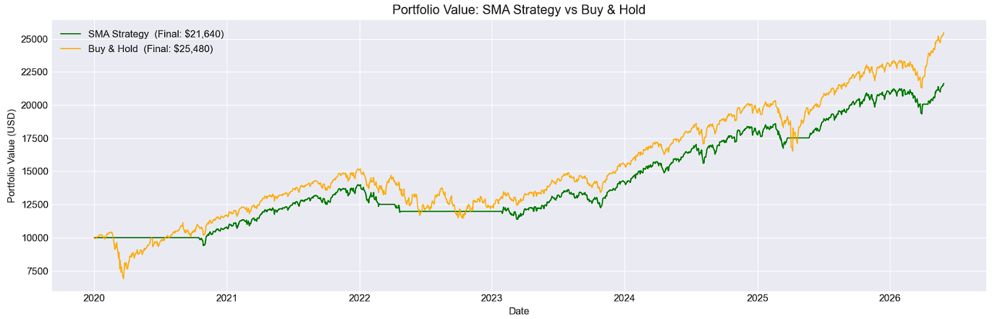

# Event-Driven Backtester: SMA Crossover (20/200) on SPY

## Overview
An event-driven backtester built from scratch in Python to test a 20/200 SMA crossover strategy on SPY (S&P 500 ETF) from 2020 to 2026.

## Strategy
- **Buy** when the 20-day SMA crosses above the 200-day SMA (golden cross)
- **Exit to cash** when the 20-day SMA crosses below the 200-day SMA (death cross)
- Benchmarked against a simple buy-and-hold of SPY

## Results

| Metric | SMA Strategy | Buy & Hold |
|--------|-------------|------------|
| Final Value | $21,639.76 | $25,480.29 |
| Total PnL | $11,639.76 | $15,480.29 |
| Sharpe Ratio | 1.13 | 0.82 |
| Max Drawdown | -18.67% | -33.72% |

> The SMA strategy sacrificed absolute returns but achieved a higher Sharpe ratio and nearly half the max drawdown of buy & hold, reflecting its defensive nature.

## Limitations
- No transaction costs or slippage modelled
- Tested on single asset (SPY) only
- No short selling as exit signal moves to cash, not short
- SPY carries inherent upward bias due to index rebalancing

## Tools
python, pandas, numpy, matplotlib, yfinance