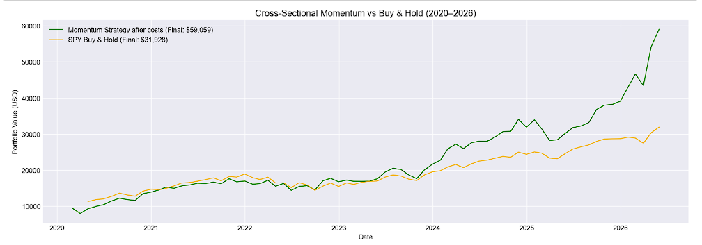

# Cross-Sectional Momentum Strategy (12-1) on S&P 500

## Overview
A long-only cross-sectional momentum strategy based on Jegadeesh & Titman (1993), implemented on the S&P 500 universe from 2020 to 2026.

Each month, stocks are ranked by their 12-1 momentum score which is the cumulative return from 12 months ago to 1 month ago. The top decile (~48 stocks) is bought equal-weighted and held for one month before rebalancing.

## Strategy
- **Universe:** S&P 500 (~485 stocks after data cleaning)
- **Signal:** 12-1 month momentum (cumulative return, skipping most recent month)
- **Portfolio:** Top decile, equal weighted (~48 stocks)
- **Rebalancing:** Monthly
- **Transaction costs:** 0.1% per trade one-way

## Results

| Metric | Momentum Strategy | SPY Buy & Hold |
|--------|-------------------|----------------|
| Final Value | $59,059.39 | $31,927.81 |
| Total PnL | $49,059.39 | $21,927.81 |
| Sharpe Ratio | 1.26 | 1.25 |
| Max Drawdown | -18.25% | -23.93% |

> The momentum strategy outperformed SPY buy & hold on total return while also sustaining a lower max drawdown, suggesting the 12-1 momentum effect persists even after accounting for realistic transaction costs.

## Why skip the most recent month?
The very short-term (1 month) exhibits mean reversion rather than momentum as stocks that just spiked tend to pull back. Excluding it produces a cleaner signal.

## Limitations
- **Survivorship bias:** Uses today's S&P 500 constituents rather than point-in-time historical composition which artificially inflates returns
- **Momentum crashes:** Strategy suffers during sharp market reversals when recent losers suddenly outperform
- **Long-only:** Classic implementation also shorts the bottom decile which is excluded here due to margin and short-squeeze complexity
- **Equal weighting:** A more sophisticated version would size positions by signal strength or volatility-adjusted weights
- **Transaction costs simplified:** Modelled as a fixed percentage; in reality varies by liquidity and trade size

## Tools
python, pandas, numpy, matplotlib, yfinance