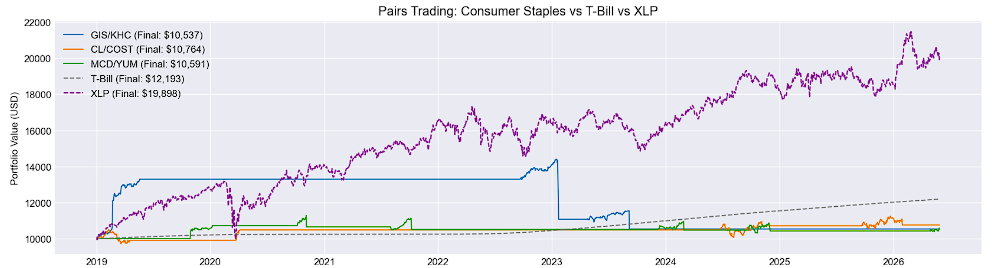

# Statistical Arbitrage: Pairs Trading on Consumer Staples

## Overview
A market-neutral pairs trading strategy implemented on US consumer staples stocks, based on the framework established by Gatev, Goetzmann & Rouwenhorst (2006). The strategy exploits mean reversion in the spread between cointegrated stock pairs, going long the relatively cheap stock and short the relatively expensive one.

## Strategy
- **Universe:** 11 US consumer staples stocks (KO, PEP, MCD, YUM, WMT, COST, PG, CL, KHC, GIS, CPB)
- **Pair selection:** Engle-Granger cointegration test at 5% significance level
- **Hedge ratio:** Estimated via OLS regression
- **Stationarity check:** Augmented Dickey-Fuller (ADF) test
- **Entry threshold:** Z-score > ±2.0
- **Exit threshold:** Z-score < ±0.5

## Pairs Traded
| Pair | P-Value | Hedge Ratio |
|------|---------|-------------|
| GIS/KHC | 0.0054 | 1.8114 |
| CL/COST | 0.0119 | 0.0373 |
| MCD/YUM | 0.0169 | 2.0696 |

## Results

| Metric | GIS/KHC | CL/COST | MCD/YUM | T-Bill | XLP |
|--------|---------|---------|---------|--------|-----|
| Final Value | $10,537 | $10,764 | $10,591 | $12,193 | $19,898 |
| Total PnL | $537 | $764 | $591 | $2,193 | $9,898 |
| Sharpe Ratio | 0.12 | 0.25 | 0.19 | N/A | 0.67 |
| Max Drawdown | -26.84% | -7.30% | -8.63% | ~0% | -24.51% |

> All three pairs underperformed both benchmarks on total return, but achieved significantly lower max drawdown than XLP thus confirming the market-neutral property of the strategy.

## Benchmarks
- **3-Month T-Bill (^IRX):** Standard benchmark for market-neutral strategies as the question is whether the strategy beats the risk-free rate, not the equity market
- **XLP (Consumer Staples ETF):** Passive benchmark tracking the exact sector being traded

## Limitations
- **Static hedge ratio:** Computed over the full period using future data. A proper implementation would use a rolling OLS window
- **No stop losses:** Strategy held losing positions when cointegration broke down rather than exiting at a loss threshold
- **No transaction costs:** Each entry and exit incurs real brokerage costs and bid-ask spread
- **Small universe:** Only 11 tickers tested
- **Short selling assumptions:** Borrow costs, margin requirements, and short-squeeze risk are not modelled

## Tools
python, pandas, numpy, matplotlib, yfinance, statsmodels